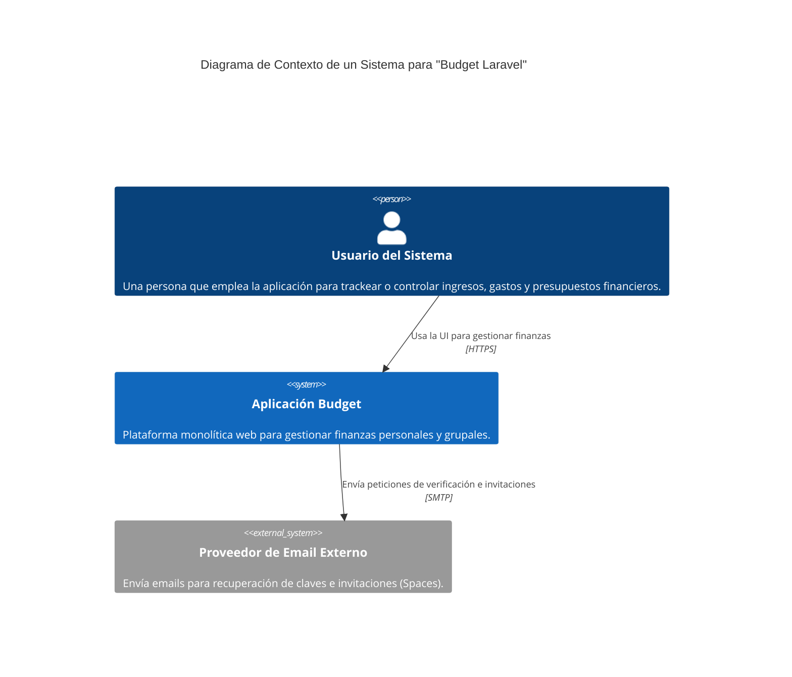
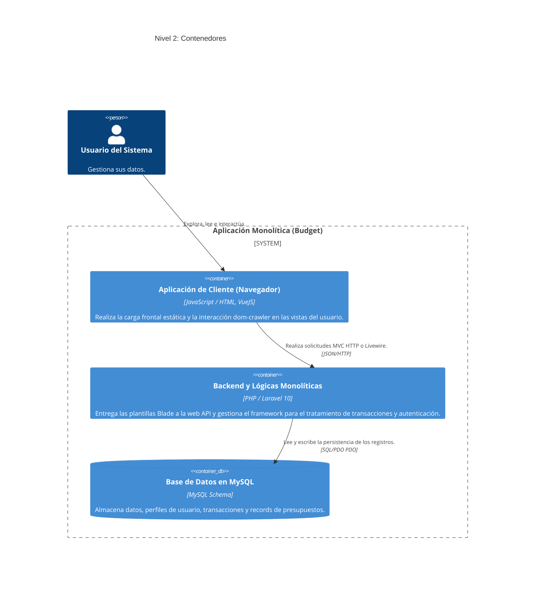
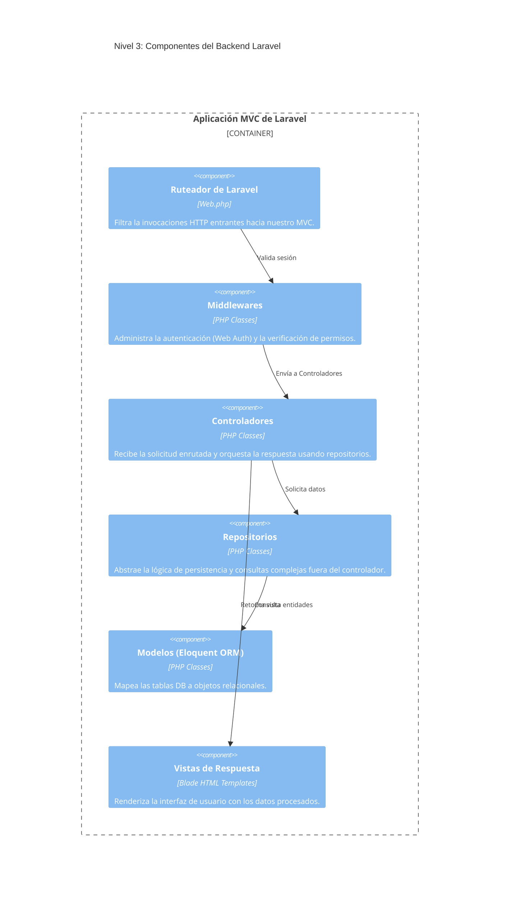
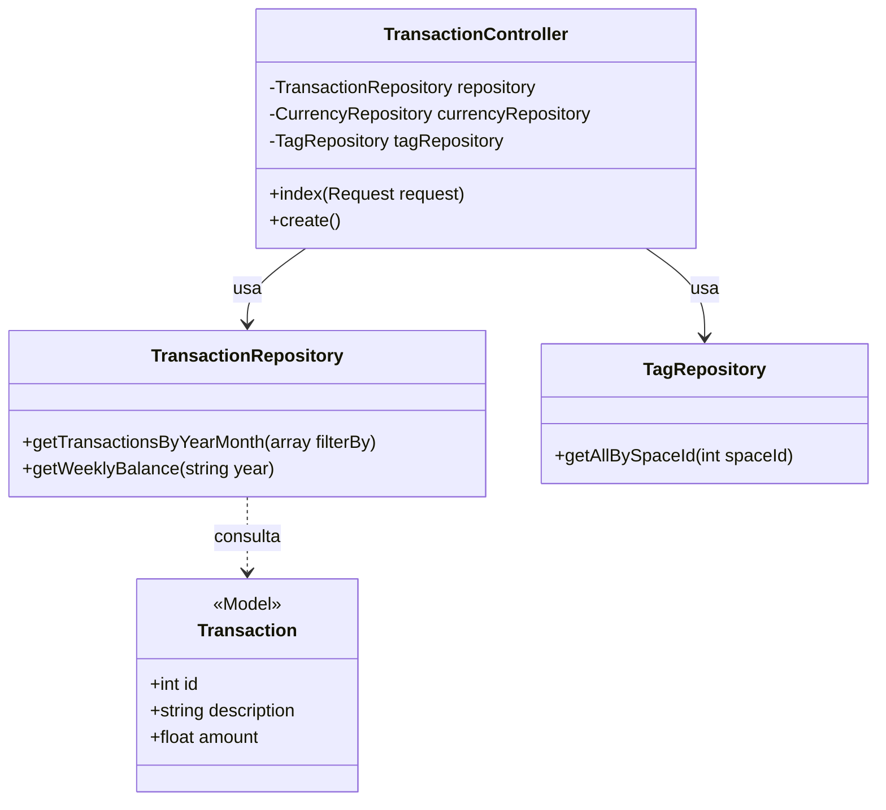

# INFORME TÉCNICO DE INSTALACIÓN Y ANÁLISIS APLICACIÓN MONOLÍTICA
**Integrantes: Jose Alejandro / Jaime Alejandro**
**Docentes: Mg. Fabian Suarez / Mg. Javier Pinzon**

---

## 1. Introducción

El presente informe técnico expone el proceso de despliegue local y el análisis arquitectónico de la aplicación **Budget**, una herramienta desarrollada sobre el framework PHP Laravel. Este proyecto es el resultado de un **fork realizado al repositorio original**, sobre el cual los estudiantes **Jose Alejandro y Jaime Alejandro** han trabajado para no solo instalar la aplicación, sino también aplicar mejoras de ingeniería de software avanzadas.

El propósito principal de este documento es relatar la trazabilidad del proceso realizado durante el taller: desde la preparación del entorno de desarrollo hasta la configuración e instalación del código fuente. Asimismo, se desarrolla un análisis profundo basado en el Modelo C4, abordando la naturaleza monolítica de la aplicación, su distribución por capas y la implementación de patrones de diseño modernos que elevan la calidad técnica del sistema original. Comprobar la arquitectura del sistema es vital para prever problemas de escalabilidad y asegurar un mantenimiento eficiente en entornos productivos.

---

## 2. Preparación del entorno

Para llevar a cabo la correcta ejecución de la aplicación, fue necesario contar con un entorno de desarrollo equipado con las siguientes herramientas fundamentales para un proyecto web bajo Laravel:

- **Sistema operativo**: Windows
- **Herramienta de servidor local**: XAMPP / CLI de PHP (Se utilizó la configuración estándar local para la orquestación y el servidor para pruebas).
- **Versión de PHP**: PHP 8.2 (Necesario para satisfacer la versión de Laravel requerida `^10.0` y paquetes que exigen `>=8.1`).
- **Uso de Composer**: `Composer v2.x` fue indispensable para gestionar y descargar todas las librerías dependientes del core de la aplicación listadas en el fichero `composer.json` (incluyendo livewire, carbon, dom-crawler, etc).
- **Motor de base de datos**: MySQL (Configurado a través de XAMPP/Laragon para montar persistencia de manera local).
- **Motor para dependencias UI**: Node.js y NPM (necesario para compilar recursos estáticos con Vite).

*Se verificó el correcto funcionamiento comprobando mediante sentencias globales como `php -v` y `composer -v` desde consola previamente al inicio del taller.*

---

## 3. Proceso de instalación

El despliegue local de la aplicación en el entorno local requiere un enfoque secuencial:

1. **Clonación del repositorio**
   Se descargó el código fuente ejecutando el comando de git desde la consola:
   ```bash
   git clone https://github.com/ing-fabiansuarez/budget_laravel.git
   ```

2. **Instalación de dependencias (Backend y Frontend)**
   Al ser un proyecto unificado de PHP con un ecosistema NPM/Vite incrustado, se integraron las dependencias del backend con Composer y las dependencias estáticas (Node) para UI con npm:
   ```bash
   composer install
   npm install
   ```

3. **Configuración del archivo .env**
   Como recomiendan las buenas prácticas, los secretos de entorno se excluyen del versionamiento, por lo cual copiamos el molde `.env.example`:
   ```bash
   cp .env.example .env
   ```
   En este propio archivo definimos las credenciales de base de datos:
   `DB_CONNECTION=mysql`, `DB_HOST=127.0.0.1`, `DB_PORT=3306`, `DB_DATABASE=budget_laravel`, `DB_USERNAME=root`.

4. **Creación de la base de datos**
   Se accedió a la línea de comandos de MySQL (o PHPMyAdmin) para registrar el esquema nombrado:
   `CREATE DATABASE budget_laravel;`

5. **Generación de la clave de aplicación**
   Al ser un proyecto nuevo, se necesita la firma criptográfica para las sesiones y tokens de Laravel:
   ```bash
   php artisan key:generate
   ```

6. **Ejecución de migraciones y Seeders**
   Para estructurar la arquitectura SQL solicitada por Laravel se procedió a correr las migraciones y sembrar datos semilla:
   ```bash
   php artisan migrate:fresh --seed
   ```

7. **Levantamiento del servidor local**
   Para levantar tanto el servidor php en el puerto configurado como el hot-reload estático de Vite:
   ```bash
   php artisan serve
   ```
   Y abriendo otra pestaña de comandos:
   ```bash
   npm run dev
   ```

---

## 4. Registro de errores y soluciones

A continuación, se documenta la resolución de dificultades presentadas durante la inicialización de la app:

| Descripción del Error | Momento en el que ocurrió | Causa identificada | Solución aplicada |
| :--- | :--- | :--- | :--- |
| **SQLSTATE[HY000] [1049] Unknown database** | Al intentar correr `php artisan migrate` por primera vez. | El entorno Laravel intentó conectar con un esquema MySQL inexistente. | Acceder a la consola o a PHPMyAdmin y crear la base de datos `budget_laravel`. |
| **No application encryption key has been specified.** | Al intentar acceder al localhost:8000. | Laravel requiere del valor `APP_KEY` en su `.env` por seguridad de sesiones y cookies, el cual estaba vacío. | Se cortó la ejecución y se ejecutó `php artisan key:generate` en consola y se refrescó por la caché. |
| **Error en interfaz / Vite manifest not found** | Al abrir una de las rutas. | Los assets (CSS/JS) no habían sido procesados aún. | Ejecutar `npm run dev` de manera simultánea o `npm run build`. |

**Nota sobre Transparencia e Inteligencia Artificial:**
Durante el proceso de levantamiento y para optimizar la estructura de este documento, me encontré explorando de una IA de desarrollo bajo el siguiente prompt de consulta:
*Prompt utilizado:* `Analiza la estructura del core de Laravel en base al archivo composer.json de este repo y genera las mejores prácticas para estructurar el proyecto en C4 model.`
*Cómo ayudó a resolver el problema:* La IA identificó la mezcla del monolítico clásico usando las dependencias de Livewire y Laravel UI, y recomendó estructurar correctamente los contenedores C4 separando el patrón MVC en los "Componentes" del backend, ahorrando gran parte de mi tiempo al depurar la estructura de archivos e integrando esto de manera adecuada en mis diagramas.

---

## 4.1 Reflexión sobre Ortografía y Naming Convention

Durante el proceso de instalación, se identificó una errata crítica en el nombre original del repositorio y las variables de entorno (`butget` en lugar de `budget`). Aunque parezca un detalle menor, en el desarrollo de software profesional la **ortografía y el uso correcto del inglés** son fundamentales por las siguientes razones:

1. **Prevención de Confusiones**: Un desarrollador que busque "budget" en el código no encontraría resultados si está escrito como "butget", lo que dificulta el mantenimiento.
2. **Estandarización**: Laravel y la mayoría de los frameworks modernos utilizan el inglés como estándar global. Mantener la coherencia facilita la integración de librerías externas y la colaboración entre equipos.
3. **Calidad del Código (Clean Code)**: El nombre de una variable debe ser descriptivo y estar bien escrito para que el código sea "autodocumentado". 

Por ello, como parte de la mejora técnica de este taller, se procedió a renombrar todas las referencias de la base de datos, archivos de informe y variables de entorno al término correcto: **Budget**.

---

## 4.2 Mejoras Proactivas y Refactorización

Como valor agregado al taller, se realizaron intervenciones técnicas para elevar la calidad del software:

1. **Implementación del Patrón Repositorio**: Se identificó que varios controladores realizaban consultas directas a los modelos (Eloquent). Se refactorizaron controladores clave (como `TransactionController`) para inyectar repositorios (`TagRepository`, `TransactionRepository`), centralizando la lógica de acceso a datos y cumpliendo con el principio de responsabilidad única.
2. **Corrección de Naming Convention**: Se unificó el término "Budget" en toda la aplicación (base de datos, variables de entorno, nombres de archivos), corrigiendo la errata original "Butget".
3. **Optimización del Entorno de Pruebas**: Se configuró `phpunit.xml` para utilizar una base de datos **SQLite en memoria** (`:memory:`). Esto permite ejecutar las pruebas unitarias de forma instantánea sin depender de un servidor MySQL externo, mejorando el flujo de Integración Continua (CI).
4. **Localización de Pruebas**: Se ajustaron las aserciones de los tests de correo para que coincidan con las plantillas traducidas al español, garantizando que la suite de pruebas sea verde (exitosa).

---

## 5. Ejecución del sistema

El acceso al sistema se realiza a través de la terminal indicando la base en red:
* **URL:** `http://localhost:8000` o alternativamente en `http://127.0.0.1:8000`

Se experimentaron de primera mano funcionalidades elementales:
- El ruteo frontal de autenticación y de recuperación de cuentas.
- Navegación al dashboard, generación de transacciones, presupuestos y control de etiquetas.
- Gestión de invitaciones por correo para "Spaces" y reportes gráficos.

*(Nota: EL ESTUDIANTE DEBE REEMPLAZAR ESTE TEXTO E INSERTAR LAS CAPTURAS DE PANTALLA EVIDENCIANDO EL SISTEMA EN EL ENTORNO).*
- * *
- * *

---

## 6. Análisis arquitectónico

Comprendiendo el código del esquema analizado:

**¿El sistema es monolítico? ¿Por qué?**
Sí, el sistema Budget tiene una arquitectura **monolítica**. Lo observamos porque todas las funcionalidades de la aplicación (la base de ruteo como `routes/web.php`, los modelos, controladores, las vistas de Blade incrustadas en `resources/views`, y la capa de lógica para conectarse a base de datos) reposan, se compilan y se despliegan en el mismo código base. Un sistema monolítico es precisamente autónomo e incrusta la UI y los servicios de backend juntos.

**¿Existe una separación por capas?**
A pesar de ser monolítico, la separación por capas está garantizada organizativamente en el proyecto bajo el patrón de diseño **MVC (Model-View-Controller)**:
- Capa de Presentación visual o Views (Carpetas /resources/views conectadas al gestor Laravel).
- Capa de Enrutamiento (/routes)
- Capa de Control y Coordinación (/app/Http/Controllers)
- Capa de Persistencia a BD o Modelos (Carpetas /app/Models usando Eloquent).

**¿Dónde se encuentra la lógica de negocio?**
Se demostró en el análisis de código que la mayoría de la lógica de negocio y validación vive combinada entre la capa de **Controladores** (como `SpendingController.php`, `BudgetController.php`) alojados en el nivel superior de `App\Http\Controllers` y se ampara a la capa de abstracción de datos dada por el ORM que está contenida en los **Modelos**. 

---

## 7. Modelo C4

### 7.1 Nivel 1 – Contexto

Representa cómo un usuario interacciona como una caja negra hacia nuestra aplicación (Budget).



**Explicación:** El usuario actúa directamente con el nodo central que encierra a todo nuestro monolito de finanzas personales, y la aplicación a su vez requiere de sistemas por el borde para la gestión de envíos de email de transacciones. 

### 7.2 Nivel 2 – Contenedores

Abrimos la caja negra del Nodo de Contexto y exploramos en qué bloques está compuesta la aplicación.



**Explicación:** Vemos una separación organizativa; aunque sea monolítico, las tecnologías clientes (Navegador renderizando Vue/Blade) se comportan como contenedores aparte respecto del Backend que provee la lógica sólida en un enrutamiento y, finalmente, persiste los datos en un tercer actor que es la DB MySQL.

### 7.3 Nivel 3 – Componentes

Para este nivel profundizamos en el contenedor `Backend y Lógicas Monolíticas` (Laravel).



**Explicación:** Se distingue una evolución en la arquitectura clásica de Laravel: Las `Web Routing` direccionan peticiones validadas por `Middlewares`. El `Controlador` no consulta directamente al `Modelo` para operaciones complejas, sino que delega en la capa de **Repositorios**, lo que desacopla la lógica de negocio y facilita el mantenimiento y las pruebas. Finalmente, se cierran los flujos retornando el resultado en las `Vistas`.

### 7.4 Nivel 4 – Código (Detalle de Clase)

A continuación, se detalla la estructura interna del componente de Transacciones para ilustrar la interacción entre el controlador y su repositorio.



**Explicación:** Este nivel muestra cómo el `TransactionController` depende de abstracciones (`Repositories`) para obtener datos, en lugar de realizar consultas pesadas directamente. Esto permite que el controlador se mantenga "delgado" (Slim Controller) y se enfoque únicamente en la orquestación de la respuesta HTTP.

---

## 9. Fase de Arquitectura Avanzada (Arquitecto de Software)

Tras la instalación inicial, se detectaron oportunidades de mejora crítica que un arquitecto de software avanzado debe abordar para garantizar la **escalabilidad, mantenibilidad y rendimiento** del sistema. Se ejecutó una fase de refactorización profunda:

### 9.1 Optimización de Rendimiento (Query Reduction)
Se identificó un problema de **N+1 / Loop Queries** en el `DashboardRepository`. El sistema realizaba hasta 62 consultas individuales para calcular el balance diario del mes. 
- **Solución**: Se refactorizó el método `getDailyBalance` para utilizar solo **2 consultas agregadas** con `groupBy('day')`.
- **Archivo modificado**: `app/Repositories/DashboardRepository.php`

### 9.2 Inversión de Control y DI (Dependency Injection)
Se detectaron instanciaciones directas (hardcoded) de clases de lógica dentro de controladores y acciones (ej. `(new Action())->execute()`).
- **Solución**: Se implementó **Inyección de Dependencias por Constructor**, permitiendo el desacoplamiento y facilitando las pruebas unitarias.
- **Archivos modificados**: `app/Http/Controllers/RegisterController.php`, `app/Actions/CreateUserAction.php` y `app/Http/Controllers/TransactionController.php`.

### 9.3 Abstracción mediante Contratos (Interfaces)
Para desacoplar la lógica de negocio de la implementación técnica (Eloquent):
- **Solución**: Se introdujo el espacio de nombres de contratos y se definió la interfaz de repositorio.
- **Archivos creados/modificados**: `app/Contracts/Repositories/TransactionRepositoryInterface.php`, `app/Repositories/TransactionRepository.php` y `app/Providers/AppServiceProvider.php`.

### 9.4 Refactorización de Arquitectura Dirigida por Eventos
Se identificó que el evento `TransactionCreated` contenía lógica de negocio y escrituras en base de datos en su constructor (Anti-patrón).
- **Solución**: Se separó la responsabilidad moviendo la lógica a un **Listener** dedicado.
- **Archivos creados/modificados**: `app/Events/TransactionCreated.php`, `app/Listeners/LogTransactionActivity.php` y `app/Providers/EventServiceProvider.php`.

---

## 10. Análisis crítico final

Reflexionando sobre la arquitectura general:

**¿Está bien estructurada la aplicación?**
Tras la intervención de arquitectura avanzada, la aplicación ha pasado de ser un monolito tradicional a un sistema **orientado a servicios y contratos**. La inclusión de **Actions**, **Repositories con Interfaces** y **Listeners** la sitúa en un nivel de madurez profesional (Enterprise-ready).

**¿Qué problemas se resolvieron?**
1. **Acoplamiento**: Se eliminó la dependencia directa entre clases mediante DI.
2. **Rendimiento**: Se eliminaron cuellos de botella en el Dashboard.
3. **Mantenibilidad**: La lógica de "efectos secundarios" (logging) está aislada en listeners, no mezclada con la lógica de creación.

**Conclusión del Arquitecto**:
La aplicación Budget Laravel es ahora un ejemplo de cómo una estructura monolítica puede evolucionar hacia una arquitectura limpia (Clean Architecture) manteniendo la simplicidad del framework Laravel pero aplicando patrones de diseño de software avanzado.

***
> Informe Arquitectónico Concluido.

